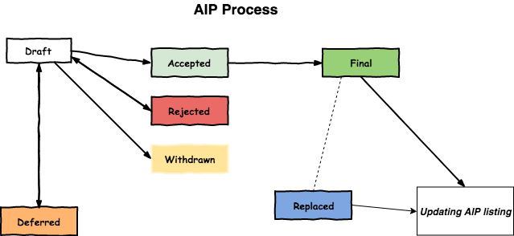

What is an AIP?
--------------

AIP stands for ADAMANT Improvement Proposal. An AIP is a document providing information to the community, or describing a new feature or its processes or environment. The AIP should provide a concise technical specification of the feature and a rationale for the feature. The AIP author is responsible for building consensus within the community and documenting dissenting opinions.

AIP Rationale
-------------

We intend AIPs to be the primary mechanisms for proposing new features, for collecting community input on an issue, and for documenting the design decisions that have gone into live network. Because the AIPs are maintained as text files in a versioned repository, their revision history is the historical record of the feature proposal.

Also AIPs help with bringing multiple implementation of ADAMANT Messengers to come to common standart with communication and storing data in blockchain.

For ADAMANT implementers, AIPs are a convenient way to track the progress of their implementation. Ideally each implementation maintainer would list the AIPs that they have implemented. This will give end users a convenient way to know the current status of a given implementation or library.

AIP Types
---------

There are three types of AIP:

-   A **Standard AIP** describes any change that affects most or all ADAMANT implementations, such as a change to the the network protocol, a change in block or transaction validity rules, proposed application standards/conventions, or any change or addition that affects the interoperability of applications using ADAMANT. Furthermore Standard AIPs can be broken down into the following categories.
    -   **Core** - improvements affecting node features. 
    -   **Networking** - includes improvements around network itself and cross-node communications.
    -   **API** - includes improvements around client API/RPC specifications and standards, and also certain language-level standards. 
    -   **ARC** - (ADAMANT Request for Comments) application-level standards and conventions, including standards such URI schemes, library/package formats, naming restrictions and wallet formats .

-   An **Informational AIP** describes an ADAMANT design issue, or provides general guidelines or information to the community, but does not propose a new feature. Informational AIPs do not necessarily represent  community consensus or a recommendation, so users and implementers are free to ignore Informational EIPs or follow their advice.
-   A **Meta AIP** describes a process surrounding ADAMANT or proposes a change to (or an event in) a process. Meta AIPs focus mostly on social mechanisms and processes, not on tecnical implementation. Technical implementation for Meta AIPs can be made in Standart AIPs.

AIP Work Flow
-------------

The AIP repository editors change the AIPs status. Please send all AIP-related email to the AIP editors or preferably (e.g. for public transparency) you can ping one of the Editors that is involved with your pull request (PR); they are listed under [AIP editors below](https://github.com/Adamant-im/AIPs/blob/master/AIPS/aip-1.md#Aip-editors). Also see [AIP Editor Responsibilities & Workflow](https://github.com/Adamant-im/AIPs/blob/master/AIPS/aip-1.md#aip-editor-responsibilities-and-workflow).

The AIP process begins with a new idea for ADAMANT. It is highly recommended that a single AIP contain a single key proposal or new idea. A change to one client doesn't require an AIP; a change that affects multiple clients, or defines a standard for multiple apps to use, does. The AIP editor reserves the right to reject AIP proposals if they appear too unfocused or too broad. If in doubt, split your AIP into several well-focused ones.

Each AIP must have a champion—someone who writes the AIP using the style and format described below, shepherds the discussions in the appropriate forums, and attempts to build community consensus around the idea.

Vetting an idea publicly before going as far as writing an AIP is meant to save the potential author time. Asking the community first if an idea is original helps prevent too much time being spent on something that is guaranteed to be rejected based on prior discussions (searching the Internet does not always do the trick). It also helps to make sure the idea is applicable to the entire community and not just the author. Just because an idea sounds good to the author does not mean it will work for most people in most areas where ADAMANT is used. Examples of appropriate public forums to gauge interest around your AIP include  [the Issues section of this repository]. In particular, [the Issues section of this repository] is an excellent place to discuss your proposal with the community and start creating more formalized language around your EIP.

Once the champion has asked the Ethereum community whether an idea has any chance of acceptance a draft EIP should be presented as a [pull request].

If the EIP editors approve the EIP ([see the AIP editors workflow section below for details](https://github.com/Adamant-im/AIPs/blob/master/AIPS/aip-1.md#eip-editor-responsibilities-and-workflow)) and the authors are happy for it to be merged as a draft, the AIP editor will assign the AIP a number and merge your pull request. The AIP editor will not unreasonably deny an AIP. (AIP authors can request for it to be merged after they have finished editing it, and editors can ask if they have finished editing it and would like it to be merged. This prevents merging an AIP when more edits are intended to be made by the author, although it can always be edited after merging.) Reasons for denying AIP status include duplication of effort, being technically unsound, not providing proper motivation or addressing backwards compatibility, or not in keeping with the ADAMANT philosophy.

Once the first draft has been merged, you may submit follow-up pull requests with further changes to your draft until such point as you believe the AIP to be mature and ready to proceed to the next phase.

Standards AIPs consist of two parts, a design document and implementation. The AIP should be reviewed and accepted before an implementation is begun, unless an implementation will aid people in studying the AIP. Standards Core AIPs must be implemented in live network before it can be considered Final.

For an AIP to be accepted it must meet certain minimum criteria. It must be a clear and complete description of the proposed enhancement. The enhancement must represent a net improvement. The proposed implementation, if applicable, must be solid and must not complicate the protocol unduly.

Once an AIP has been accepted, the implementations must be completed. When the implementation is complete and accepted by the community, the status will be changed to “Final”.

An AIP can also be assigned status “Deferred”. The AIP author or editor can assign the AIP this status when no progress is being made on the AIP. Once an AIP is deferred, the AIP editor can re-assign it to draft status.

An AIP can also be “Rejected”. Perhaps after all is said and done it was not a good idea. It is still important to have a record of this fact.

AIPs can also be superseded by a different AIP, rendering the original obsolete.

The possible paths of the status of AIPs are as follows:

Some Informational and Process AIPs may also have a status of “Active” if they are never meant to be completed, e.g. AIP 1 (this AIP).

What belongs in a successful AIP?
---------------------------------

Each AIP should have the following parts:

-   Preamble - RFC 822 style headers containing metadata about the AIP, including the AIP number, a short descriptive title (limited to a maximum of 44 characters), and the author details. See [below](https://github.com/Adamant-im/AIPs/blob/master/AIPS/aip-1.md#Aip-header-preamble) for details.
<!-- -->

-   Simple Summary - “If you can’t explain it simply, you don’t understand it well enough.” Provide a simplified and layman-accessible explanation of the AIP.

<!-- -->

-   Abstract - a short (~200 word) description of the technical issue being addressed.

<!-- -->

-   Motivation (*optional) - The motivation is critical for AIPs that want to change the ADAMANT protocol. It should clearly explain why the existing protocol specification is inadequate to address the problem that the AIP solves. AIP submissions without sufficient motivation may be rejected outright.

<!-- -->

-   Specification - The technical specification should describe the syntax and semantics of any new feature. The specification should be detailed enough to allow competing, interoperable implementations for different platforms.

<!-- -->

-   Rationale - The rationale fleshes out the specification by describing what motivated the design and why particular design decisions were made. It should describe alternate designs that were considered and related work, e.g. how the feature is supported in other languages. The rationale may also provide evidence of consensus within the community, and should discuss important objections or concerns raised during discussion.

<!-- -->

-   Backwards Compatibility - All AIPs that introduce backwards incompatibilities must include a section describing these incompatibilities and their severity. The AIP must explain how the author proposes to deal with these incompatibilities. AIP submissions without a sufficient backwards compatibility treatise may be rejected outright.

<!-- -->

-   Test Cases - Test cases for an implementation are mandatory for AIPs that are affecting consensus changes. Other AIPs can choose to include links to test cases if applicable.

<!-- -->

-   Implementations - The implementations must be completed before any AIP is given status “Final”, but it need not be completed before the AIP is accepted. While there is merit to the approach of reaching consensus on the specification and rationale before writing code, the principle of “rough consensus and running code” is still useful when it comes to resolving many discussions of API details.

<!-- -->

-   Copyright Waiver - All AIPs must be in the public domain. See the bottom of this AIP for an example copyright waiver.

EIP Formats and Templates
-------------------------

AIPs should be written in [markdown] format.
Image files should be included in a subdirectory of the `assets` folder for that AIP as follow: `assets/Aip-X` (for Aip **X**). When linking to an image in the AIP, use relative links such as `../assets/aip-X/image.png`.

AIP Header Preamble
-------------------

Each AIP must begin with an RFC 822 style header preamble, preceded and followed by three hyphens ('---'). The headers must appear in the following order. Headers marked with "*" are optional and are described below. All other headers are required.

` aip: ` <AIP number> (this is determined by the AIP editor)

` title: `<AIP title>

` author: `<a list of the author's or authors' name(s) and/or username(s), or name(s) and email(s). Details are below.>

` * discussions-to: ` <url>

` status: `<Draft | Active | Accepted | Deferred | Rejected | Withdrawn | Final | Replaced>

` type: `<Standard (Core, Networking, Interface, API, ARC)  | Informational | Meta>

` * category `: <Core | Networking | Interface | API | ARC>

` created: `<date created on, in ISO 8601 (yyyy-mm-dd) format>

` * requires: `<AIP number(s)>

` * replaces: `<AIP number(s)>

` * replaced-by: `<AIP number(s)>

` * resolution: `<url>

#### Author header
The author header optionally lists the names, email addresses or usernames of the authors/owners of the AIP. Those who prefer anonymity may use a username only, or a first name and a username. The format of the author header value must be:

Random J. User &lt;address@doma.in&gt;

or

Random J. User (@username)

if the email address or GitHub username is included, and

Random J. User

if the email address is not given.

Note: The resolution header is required for Standard AIPs only. It contains a URL that should point to an email message or other web resource where the pronouncement about the AIP is made.

While an AIP is a draft, a discussions-to header will indicate the mailing list or URL where the AIP is being discussed. As mentioned above, examples for places to discuss your AIP include  an issue in this repo or in a fork of this repo. No discussions-to header is necessary if the AIP is being discussed privately with the author.

The type header specifies the type of AIP: Standard, Meta, or Informational. If the track is Standard please include the subcategory (core, networking, interface, API, or ARC).

The category header specifies the AIP's category. This is required for standard AIPs only.

The created header records the date that the AIP was assigned a number. Both headers should be in yyyy-mm-dd format, e.g. 2001-08-14.

AIPs may have a requires header, indicating the AIP numbers that this AIP depends on.

AIPs may also have a replaced-by header indicating that an AIP has been rendered obsolete by a later document; the value is the number of the AIP that replaces the current document. The newer AIP must have a Replaces header containing the number of the AIP that it rendered obsolete.

Headers that permit lists must separate elements with commas.

Auxiliary Files
---------------

EIPs may include auxiliary files such as diagrams. Such files must be named EIP-XXXX-Y.ext, where “XXXX” is the EIP number, “Y” is a serial number (starting at 1), and “ext” is replaced by the actual file extension (e.g. “png”).

Transferring EIP Ownership
--------------------------

It occasionally becomes necessary to transfer ownership of EIPs to a new champion. In general, we'd like to retain the original author as a co-author of the transferred EIP, but that's really up to the original author. A good reason to transfer ownership is because the original author no longer has the time or interest in updating it or following through with the EIP process, or has fallen off the face of the 'net (i.e. is unreachable or isn't responding to email). A bad reason to transfer ownership is because you don't agree with the direction of the EIP. We try to build consensus around an EIP, but if that's not possible, you can always submit a competing EIP.

If you are interested in assuming ownership of an EIP, send a message asking to take over, addressed to both the original author and the EIP editor. If the original author doesn't respond to email in a timely manner, the EIP editor will make a unilateral decision (it's not like such decisions can't be reversed :)).

AIP Editors
-----------

The current AIP editors are

` * Dmitriy Soloduhin (@zyuhel)`

` * Alexey Lebedev (@adamant-al)`

AIP Editor Responsibilities and Workflow
--------------------------------------

For each new AIP that comes in, an editor does the following:

-   Read the AIP to check if it is ready: sound and complete. The ideas must make technical sense, even if they don't seem likely to be accepted.
-   The title should accurately describe the content.
-   Check the AIP for language (spelling, grammar, sentence structure, etc.), markup (Github flavored Markdown), code style

If the AIP isn't ready, the editor will send it back to the author for revision, with specific instructions.

Once the AIP is ready for the repository, the AIP editor will:

-   Assign an AIP number (generally the PR number or, if preferred by the author, the Issue # if there was discussion in the Issues section of this repository about this AIP)

<!-- -->

-   Accept the corresponding pull request

<!-- -->

-   Send a message back to the AIP author with the next step.

Many AIPs are written and maintained by developers with write access to the Ethereum codebase. The AIP editors monitor AIP changes, and correct any structure, grammar, spelling, or markup mistakes we see.

The editors don't pass judgment on AIPs. We merely do the administrative & editorial part.

History
-------

This document was derived heavily from [Ethereum's AIP-1] written by Martin Becze and Hudson Jameson, which in turn was derived from [Bitcoin's BIP-0001] written by Amir Taaki which in turn was derived from [Python's PEP-0001]. In many places text was simply copied and modified. So all writers of original text are not responsible for its use in the ADAMANT Improvement Process, and should not be bothered with technical questions specific to ADAMANT or the AIP. Please direct all comments to the AIP editors.

See [the revision history for further details](https://github.com/Adamant-im/AIPs/commits/master/AIPS/aip-1.md), which is also available by clicking on the History button in the top right of the AIP.

### Bibliography

  [pull request]: https://github.com/Adamant-im/AIPs/pulls
  [the Issues section of this repository]: https://github.com/Adamant-im/AIPs/issues
  [markdown]: https://github.com/adam-p/markdown-here/wiki/Markdown-Cheatsheet
  [Ethereum's AIP-1]: https://github.com/ethereum/EIPs/blob/master/EIPS/eip-1.md
  [Bitcoin's BIP-0001]: https://github.com/bitcoin/bips
  [Python's PEP-0001]: https://www.python.org/dev/peps/

Copyright
---------

Copyright and related rights waived via [CC0](https://creativecommons.org/publicdomain/zero/1.0/).
